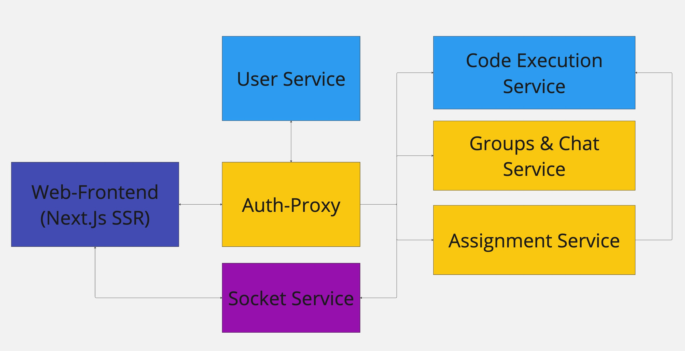

# CodeCanvas

.

CodeCanvas is an online platform to practise programming in an collaborative environment. 
Some tutors can create assignments for you to to and complete. As a registered student you can complete these tasks and get your result graded. 

**NOTE: Currently there is an QuestionBased option for Assignments, but it does not work yet properly. It is not implemented yet.**

## Service constellation

